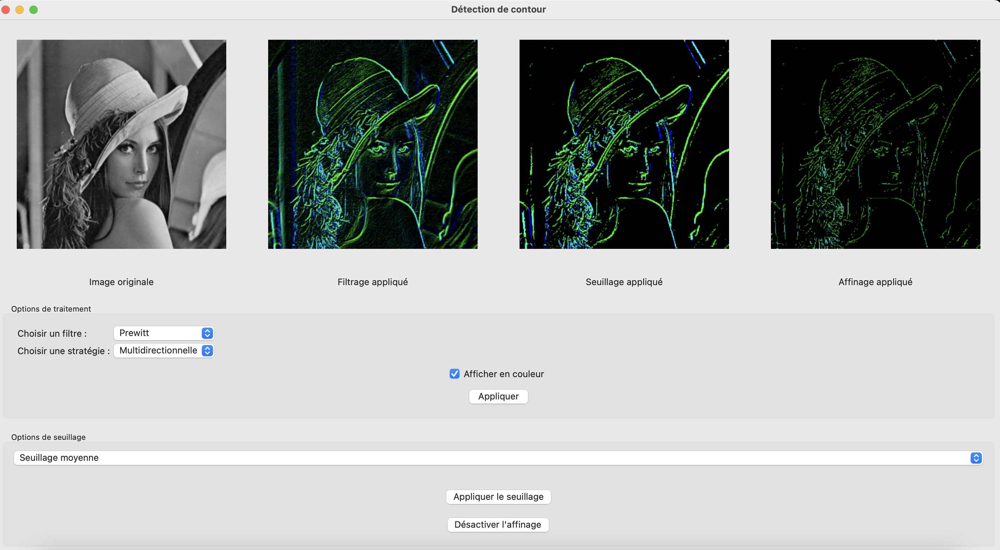

# Application permettant de détecter les contours d'une image

## Aperçu du Projet

  

Ce projet est une application graphique utilisant wxWidgets et OpenCV pour effectuer de la détection de contours sur une image, avec différentes options de filtrage, seuillage et affinage.

## Installation et Lancement

1. Installer wxWidgets et OpenCV

2. Compiler le projet avec CMake :
   mkdir build && cd build && cmake .. && make

3. Exécuter l'application :
   ./ImageProject

## Utilisation

- Ouvrir une image via le menu File > Ouvrir une image
- Appliquer un filtre et une stratégie
- Choisir un type de seuillage (utiliser le slider si seuillage manuel)
- Activer/Désactiver l'affinage des contours
